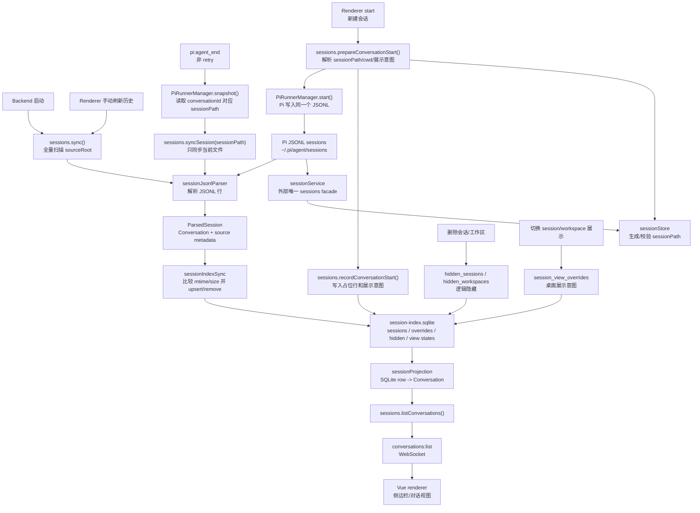

# Pi RUNNER 设计说明

## 目标

本文档描述 Pi RUNNER 当前的产品与架构设计，是面向实现细节的设计说明，并与 `PRODUCT.md` 配套使用。

Pi RUNNER 是 Pi 会话与 Pi 运行时进程之上的桌面投影视图。它有两个核心职责：

1. 将 Pi 会话历史转换成稳定的用户可见视图。
2. 管理正在运行的 Pi agent 进程，同时避免把前台 UI 状态和进程所有权混在一起。

它不替代 Pi，不改写 Pi 历史，也不创建第二套会话事实来源。

## 系统模型

```text
Pi JSONL sessions
  -> backend session parser
  -> SQLite desktop projection
  -> WebSocket protocol
  -> Vue renderer

renderer command
  -> backend message dispatcher
  -> backend/pi facade
  -> PiRunnerManager
  -> PiProcessRunner
  -> pi:* events with conversationId
  -> renderer event reducer
```

设置页使用同一条 WebSocket 边界，但不进入会话生命周期：

```text
renderer settings action
  -> backend settings service
  -> ~/.pi/agent/models.json / ~/.pi/agent/settings.json / Pi ResourceLoader skills / pi install command
  -> settings snapshot
  -> Vue settings view
```

设置页编辑的是 Pi 的真实配置。`models.json` 和 `settings.json` 在 backend 校验 JSON 后，通过同目录临时文件和原子 rename 替换，避免进程退出或写入失败截断现有配置；读取时只有 `ENOENT` 被解释为文件不存在，其他错误必须反馈给用户。Renderer 会保留未保存草稿，脏状态下禁止刷新覆盖，并提供逐文件还原。

最重要的边界是持久历史和实时运行时之间的边界：

- Pi JSONL 文件是真实历史。
- SQLite 是桌面端视图投影。
- `backend/pi/index.ts` 是实时进程管理公开入口，`PiRunnerManager` 以规范化 `sessionPath` 维护 live runner；`conversationId` 是当前附着到该 runner 的 renderer 视图身份。
- Renderer runtime 只负责 UI 本地的瞬态状态。
- 用户粘贴或拖拽的图片先作为 renderer draft 附件存在，发送时随 `prompt` RPC 的 `images` 字段交给 Pi；Desktop 额外保存图片展示投影用于回看，但不改写 Pi JSONL。

## 产品界面

应用包含一个面向任务的主窗口和一个独立桌面宠物窗口。主窗口外壳包括：

- 侧边栏：会话与工作区。
- 顶部栏：新建会话、命令面板入口、桌面宠物入口、历史同步、设置入口、连接与运行状态信号。
- 命令面板：顶部栏搜索按钮或 `Cmd/Ctrl+K` 触发的本地快速入口，负责搜索常用操作、会话标题、工作区路径和运行状态。
- 设置页：覆盖当前应用 shell，集中展示 Pi 安装状态、`settings.json` 编辑、`models.json` 编辑、本地 skills。
- 消息区：时间线导航、流式消息、用户图片快照与图片查看器、thinking、工具调用、错误、模型仍在工作状态。
- 输入区：prompt 输入、图片粘贴/拖拽、停止/发送、待处理 follow-up 控件。
- Toast 层：全局成功/失败反馈。

桌面宠物是透明置顶的辅助窗口，不进入会话、设置或 backend 状态树。它由主窗口按钮或 Tray 唤起，窗口内只运行独立的像素宠物组件。

UI 应保持紧凑、可预测。避免营销式布局、解释性功能文案、装饰性卡片和以弹窗为主的流程。

## 会话投影

### 源会话

Pi 拥有真实会话历史，通常位于：

```text
~/.pi/agent/sessions
```

Desktop 读取这个目录并解析 JSONL 文件。如果文件在桌面应用外被删除，下一次同步会把它视为真实历史消失。

### Desktop SQLite 投影

Desktop 将自己的投影存储在：

```text
~/pi.runner/data/session-index.sqlite
```

可以通过 `PI_DESKTOP_DATA_DIR` 覆盖数据目录。

SQLite 存储：

- 从 Pi JSONL 解析出的索引会话事实；
- 桌面端展示意图；
- 新建会话的占位行；
- 逻辑隐藏的会话与工作区；
- 工作区视图状态，例如置顶和折叠分组。
- 用户通过 Desktop 发送的图片消息映射；图片文件保存在数据目录的 `attachments/` 下，SQLite 只保存 message id、MIME、文件路径和 hash。
- session 行记录当前 parser 版本；当 JSONL 解析逻辑变化时，即使源文件 mtime/size 未变，也会重建 `messages_json`，避免旧投影缓存长期保留错误结构。
- JSONL 允许跳过已经完整落盘但无法识别的历史记录；如果文件最后一条物理记录是无法解析的半行，则本次同步必须失败并保留上一版 SQLite 投影，不能提交当前 mtime/size。这样下一次文件 flush 后仍会重试，不会把截断消息永久缓存成“已同步”。

SQLite 可以重建。重建时应从 Pi sessions 和可用的桌面元数据恢复；Pi 不应接受 Desktop 写入。

### Sessions 流程图



### 展示意图

`cwd` 是 Pi 运行时事实，不应自动等同于 UI 分类。

Desktop 记录一个会话应该如何展示：

- `session`：普通会话；
- `workspace`：分组到选定工作区路径下的会话。

如果没有桌面端覆盖值，可以使用从 Pi 解析出的事实作为 fallback。一旦 Desktop 记录了展示意图，就以 Desktop 的记录为准。

工作区路径是 UI 分组、隐藏、置顶、折叠和 runner 批量关闭的身份字段。所有这些入口都必须通过 `normalizeWorkspacePath()` 归一化，确保 `/tmp/project`、`/tmp/project/` 和 `/tmp/project/../project` 被视为同一个工作区。`sessionPath` 仍按 Pi session 文件路径单独处理，不复用 workspace identity 规则。

## 会话生命周期

### 创建

新建会话采用乐观流程：

1. Renderer 创建本地 `conversationId`。
2. Backend 在 Pi sessions 目录下解析未来的 `sessionPath`。
3. SQLite 记录带展示意图的占位行。
4. Backend 使用该 `sessionPath` 启动 Pi RPC。
5. 当 Pi 写出真实 JSONL 后，同步流程用解析出的历史替换占位内容。

只有 backend 已连接时才能进入该流程。顶部入口可以打开会话类型选择，但普通会话、工作区会话和已有工作区内的新建动作在断连时必须统一禁用；renderer lifecycle intent 仍需做同一检查，避免组件遗漏产生无法发送的本地占位会话。

继续已有会话不会写占位行，而是为现有 `sessionPath` 启动 runner。

### 图片输入

图片输入复用 Pi RPC 的 prompt 通道，而不是在 Desktop 内建立模型厂商适配层。

Renderer 在输入区捕获剪贴板或拖拽图片，校验格式和大小，并把静态图片压缩到适合 RPC 传输的尺寸。待发送图片保存在当前 conversation runtime 的 `draftImages` 中；切换会话时不会串到其他会话。草稿缩略图可以在发送前直接打开全局蒙版预览，发送后与历史消息继续复用同一查看器。发送时，Desktop 通过 WebSocket 发送：

```json
{
  "type": "prompt",
  "conversationId": "conversation-id",
  "prompt": "描述这张图",
  "images": [
    { "type": "image", "data": "<base64>", "mimeType": "image/png" }
  ]
}
```

Backend 只校验和透传该结构，`PiProcessRunner` 将 `images` 写入 Pi RPC JSONL 命令。OpenAI、Anthropic、Gemini 等 provider-specific 图片格式仍由 Pi 负责。Desktop 本地消息会展示本次用户图片快照，并在 renderer 侧通过图片查看器支持列表浏览。草稿区和历史消息只渲染缩略图并上报 `{images, index, trigger}` 打开意图；App shell 持有唯一的全屏查看器状态，避免每条消息各自注册全局键盘事件或保留跨会话预览状态。查看器只消费 `{id, src, alt}` 展示数据，不依赖 Pi 或 Desktop 协议，并基于标准 Dialog primitive 提供焦点隔离、关闭后的触发点恢复和背景交互阻断。全屏蒙版只保留关闭、多图切换、位置与加载/失败状态，不使用弹窗面板、标题栏或底部缩略图条；任何会切换应用上下文的全局命令都会先关闭查看器。Pi JSONL 仍是真实历史；如果历史同步后 Pi 没有记录图片，Desktop 不回写或补造 Pi 历史，只补桌面展示投影。

Backend 协议边界只接受 PNG、JPEG、WebP、GIF，最多 6 张，单张 base64 payload 按 10MB 原图量级限制。Renderer 的压缩和校验只是体验优化，不能替代 backend 边界校验。

为避免刷新后图片输入从桌面会话里消失，Backend 在 prompt 成功写入 Pi RPC 后会把图片保存为 Desktop projection。投影归属以 runner snapshot 中的 Pi source `sessionPath` 为准；`conversationId` 只是 renderer 视图身份，只能作为旧索引行的兜底查找键，不能作为图片持久化主键。

```text
~/pi.runner/data/attachments/<sha256>.<ext>
session-index.sqlite:
  message_image_attachments(session_path, message_id, position, prompt_text, mime_type, file_path, sha256, created_at)
```

投影合并只发生在 `listConversations()` 输出阶段：如果 Pi JSONL 解析出的同一条用户消息本身没有图片，Desktop 才用 `message_image_attachments` 补充 UI 展示用的 `images`。合并优先按 RPC prompt id 和 Pi message id 精确匹配；如果 Pi 写入 JSONL 时重新生成了 message id，则按 prompt 文本匹配，再按同一会话内未匹配的用户消息顺序兜底。这保证图片回看体验稳定，同时不改变 Pi 的真实历史和模型上下文来源。

运行中排队的多条 follow-up 可能累计超过单次 prompt 的图片上限。Renderer 发送队列时按 `MAX_PROMPT_IMAGES` 切出一批，剩余 pending steer 留到下一轮 agent end 后继续发送，避免生成会被 backend 协议直接拒绝的超限 prompt。

### Live runner 身份

`sessionPath` 是 live runner 的主身份。Desktop 允许同一个 Pi JSONL 历史在索引刷新前后出现不同的 `conversationId`，但同一个 `sessionPath` 在 backend 里只能对应一个 live runner。

启动流程必须满足：

- 如果 `sessionPath` 尚无 live runner，创建新的 Pi RPC 进程并登记到 `sessionPath -> runner` 表。
- 如果 `sessionPath` 已有 live runner，新的 `conversationId` 附着到现有 runner，而不是再启动一个进程或报 “already open”。
- 附着时会把后续 `pi:*` 事件路由到当前 conversation 视图，避免历史刷新后旧 id 继续接收流式输出。
- 如果同一个 `sessionPath` 试图用不同工作区上下文启动，backend 返回结构化错误，因为这代表 UI 身份和运行目录事实冲突。

Renderer 的历史合并也必须按 `sessionPath` 收敛。同一个 `sessionPath` 的后端历史刷新只能替换消息、标题和 turn 内容，不能制造第二个可发送会话入口。运行中的本地 `conversationId` 会被保留，因为 draft、pending prompt 和 runner snapshot 都绑定在这个本地视图 id 上。

### 查询

侧边栏查询 SQLite，而不是直接查询原始 Pi 文件。

投影查询顺序：

1. 读取索引行。
2. 应用展示意图覆盖。
3. 应用隐藏会话和隐藏工作区过滤。
4. 按更新时间排序。
5. 分组为普通会话和工作区。

### 文件变更归因

MVP 不生成基于 Git metadata 的 turn 变更摘要，也不把工作区 diff 归因给某一轮 agent。文件变更可能来自用户手动编辑、watcher、格式化器、工具调用或其他外部进程；在缺少可靠来源标记前，桌面端只展示 Pi RPC 里明确属于工具调用的 `diff` 元数据。

### 隐藏

侧边栏移除是逻辑隐藏。

移除会话时：

- 如果存在 live runner，先关闭它；
- 记录隐藏会话元数据；
- 从桌面视图中过滤；
- 不删除 Pi JSONL。

移除工作区时：

- 关闭该工作区下的 live runner；
- 记录隐藏工作区元数据；
- 过滤分组后的工作区会话；
- 不删除 Pi JSONL。

Renderer 执行乐观隐藏。每个隐藏请求都携带 `requestId`。Backend 成功后确认乐观变更。Backend 失败或发送失败时，恢复之前的会话列表、当前会话和 runtime map，并显示 Sonner 错误 toast。

### 导出

侧边栏导出是 renderer 侧的只读操作，不写入 Pi JSONL，也不改变 SQLite 投影。导出文件使用 Markdown，因为它面向用户阅读和分享，而不是作为内部恢复格式。

导出内容只包含 `user`、`assistant` 和 `system` 消息的正文。`thinking`、工具调用、工具输出、错误消息、`sessionPath` 和其他内部元数据都不进入导出文件，避免把运行细节混入正常对话记录。

### 工作区视图状态

工作区分组的置顶和折叠是 Desktop UI 偏好，不是会话事实，也不是删除状态。

这些状态持久化在 `workspace_view_states`：

```sql
workspace_path text primary key
is_pinned integer not null default 0
is_collapsed integer not null default 0
pinned_at real
updated_at real not null
```

字段语义：

- `workspace_path`：侧边栏分组使用的规范化工作区路径，必须来自 `normalizeWorkspacePath()`。
- `is_pinned`：该分组是否提升到侧边栏排序前部。
- `is_collapsed`：子会话是否在侧边栏树中隐藏。
- `pinned_at`：稳定置顶排序的时间戳；未置顶时为 null。
- `updated_at`：Desktop 最近写入时间，用于迁移和冲突安全的 upsert。

`hidden_workspaces` 仍然独立存在。隐藏工作区会把它从产品界面移除。折叠工作区只收起它的子项。置顶只改变排序。

运行时流程：

1. Renderer 连接后请求 `list_workspace_view_states`。
2. Backend 从 SQLite 读取 `workspace_view_states`，并发送 `workspace_view_states:list`。
3. Renderer 将置顶状态应用到侧边栏排序，将折叠状态应用到 `expandedWorkspaces`。
4. 用户切换折叠时，`expandedWorkspaces` 立即响应；置顶等持久状态发送 `update_workspace_view_state` 后，等待 backend 的 updated 消息再提交到 `workspaceViewStates`。
5. Backend upsert SQLite，并发送带持久化行的 `workspace_view_state:updated`。

如果更新发送失败，Renderer 提示本次偏好未保存。持久状态不做无法关联 request 的乐观提交，避免 WebSocket 已发送但 SQLite 写入失败时长期显示假状态；下一次成功的 list 响应仍然是权威来源。

## 同步

同步方向是单向的：

```text
Pi sessions directory -> SQLite projection
```

同步会：

- 递归扫描 JSONL 文件；
- 比较 mtime 和 size；
- 解析变更过的文件；
- upsert 解析后的行；
- 移除源文件已消失的非占位行；
- 在源文件尚未创建时保留占位行；
- 保留隐藏状态和展示意图。

同步不会：

- 写入 Pi JSONL；
- 删除 Pi JSONL；
- 将 Desktop 元数据写入 `.pi`；
- 解释 slash commands。

## 设置

设置页是 macOS-only 的本地 Pi 配置面板。进入设置时覆盖整个应用 shell，隐藏侧边栏和会话 header，避免把全局 Pi 配置误解为当前会话的局部属性。Renderer 不直接读取 `~/.pi`，所有文件和命令访问都通过 backend 的 settings service 完成。

当前设置 snapshot 包含：

- Pi 安装状态：backend 从交互式登录 shell 读取完整环境，并只在该环境的 `PATH` 中查找 Pi；检测结果只把是否安装和可执行文件路径传给 renderer。
- 一键安装：backend 先通过 `curl -fsSL https://pi.dev/install.sh` 取得并确认非空脚本，再交给 `sh`，避免下载失败被空管道误报为安装成功；最近一次安装输出作为设置状态返回。Installer 是 backend 持有的受管子进程，限制 120 秒和 1MB 输出，重复安装被拒绝；backend 退出时与 Pi runner 一起等待 TERM/KILL 收敛。Installer 继承 backend process group，使 backend 被强杀时 Electron supervisor 仍能兜底清理。该流程当前不做 Windows 兼容。
- Agent 设置：读取并保存 `~/.pi/agent/settings.json`，保存前先做 JSON 校验并格式化写回。该文件会影响 skills 路径等全局 Pi 发现规则，因此所有写入都必须经过 backend settings service。
- 模型配置：读取 `~/.pi/agent/models.json`，保存前先做 JSON 校验并格式化写回，避免把无效 JSON 写入 Pi 配置。
- Skills：优先从当前 `pi` 命令定位 Pi 安装包，并动态调用 `DefaultResourceLoader.getSkills()`，让设置页展示结果尽量与 Pi 启动时的 `[Skills]` 一致；列表中的 skill 支持从行内操作直接打开所在文件夹。若 SDK 不可用，再回退扫描 `~/.pi/agent/skills`、`~/.agents/skills` 和 settings 中显式配置的 skill 路径。

Settings 可以写 `models.json` 和 `settings.json`，但不能写 Pi sessions、SQLite 投影或 runner 状态。单文件保存与“保存并返回”都先校验 JSON；Renderer 同一时间只允许一个设置请求（读取、写入或安装），避免无 request id 的 snapshot 响应交叉覆盖另一份草稿。保存时记录已提交内容，回包不能覆盖请求发出后继续编辑的新草稿。WebSocket 断开时必须取消不会再收到响应的本地请求锁并保留草稿，让用户在重连后重试；不能让旧 `isLoading` / `isSaving` / `isInstalling` 状态阻断后续操作。`settings:save_all` 会共同校验并暂存两份文件，再顺序提交，任一步写入失败时按逆序恢复原文件。设置错误通过 `settings:error` 返回，避免被误路由到当前会话消息流；保存失败必须清理“保存后关闭”状态，后续 snapshot 不能意外关闭仍有草稿的设置页。执行官方安装脚本前由 Renderer 明确确认来源和 PATH 影响。

## macOS 应用生命周期

Pi RUNNER 当前只支持 macOS，并只交付 Apple Silicon 内测构建。窗口、应用和 Pi runner 是三个独立生命周期：BrowserWindow 的 close 事件只隐藏窗口；Dock activate 或 Tray 的“显示 Pi RUNNER”恢复同一个窗口；只有明确退出才向 backend 发送终止信号。Electron main 持有 Template Tray 和退出确认状态，但不自行推断 runner phase。

Renderer 从 backend `runner:list` / `runner:snapshot` 计算 `{ known, activeTaskCount, hasUnsavedSettings }`，并通过 preload 的窄 IPC 同步给 Electron main。刚连接但尚未收到 `runner:list`、以及断连期间都属于状态未知。Tray 只展示摘要；有进行中任务、未保存设置或状态未知时，退出必须确认并提供取消、隐藏窗口、退出并停止任务三个明确选择。系统关机/注销绕过应用确认，避免阻塞系统退出。

Electron 使用 `app.requestSingleInstanceLock()` 阻止第二套桌面实例和 backend 同时启动。Backend 以独立 process group 运行，并携带随机 instance id；Electron 只有在 `/health` 返回同一个 instance id 后才把本次 spawn 视为 ready。正常退出先只向 backend 发送 TERM，由 backend 等待 Pi 清理；backend 崩溃、启动超时或正常清理超时后，Electron 才对旧 process group 执行 TERM/KILL 收敛。旧组未确认消失时不得启动新 backend，退出期间也必须取消待执行的 restart timer。

## 多窗口与桌面宠物

Electron main 通过 `electron/windowManager.ts` 统一拥有主窗口和宠物窗口。Renderer 不保存 `BrowserWindow` 引用，也不使用 `window.open`。主窗口 preload 只新增 `showPet()`，宠物窗口使用独立 `petPreload`，只暴露隐藏、白名单状态通知和受限拖拽增量；主进程同时校验每条 IPC 的受管 `webContents` 和发送 frame 的预期 renderer URL，宠物 renderer 或已离开应用页面的 frame 都无法取得 backend token、工作区或任务摘要能力。主窗口 close 继续转换为 hide，宠物窗口的显示或隐藏不会影响 backend 和 Pi runner。

所有受管窗口都禁止 renderer 导航和创建新窗口。Markdown 中经过 DOMPurify 净化的 `http:` / `https:` 链接仍可点击，但由 Electron main 交给系统浏览器打开；应用窗口始终留在本地 renderer。`file:`、`javascript:`、无效 URL 和其他协议不会交给系统处理，服务端重定向也不能把窗口带离受信页面。

两个窗口共用 Vite 的 `index.html` 与 `src/main.ts`。主窗口使用默认入口，宠物窗口使用 `?window=pet`；`src/windowRoot.ts` 只接受 `main | pet` 白名单，未知值回退主窗口。生产环境由 `loadFile` 的结构化 query 传入窗口身份，开发环境由标准 `URL` API 设置参数。

宠物窗口固定为 `160 x 160`，透明、无 frame、不可缩放、置顶并跳过任务切换器，首次显示使用 `showInactive()` 避免抢走消息输入焦点。宿主在整个窗口监听 Pointer Events；按下时由原始表面自身取得 pointer capture，保证移出 160px 窗口后仍能收到事件，同时让短 `click` 保持原按钮为派发目标。移动超过 3px 后才确认进入拖拽并通过窄 IPC 上报单次增量，因此宠物、气泡、透明区和关闭按钮都能作为拖拽起点，真实拖拽后的合成 click 会被拦截。主进程拒绝非有限数值，并在取整后拒绝非安全整数或异常大的增量，再把最终位置约束到目标显示器 work area；绝对窗口坐标和 `BrowserWindow` 能力始终只由主进程持有。

宠物状态包含 `coding`、`resting`、`thinking`、`walking`。宿主页通过 `pet:update-state` 窄 IPC 通知主进程当前状态，主进程只接受来自宠物窗口的四个白名单值；前三种状态不移动窗口。每次进入 `walking` 时，`windowManager` 以宠物当前所在显示器的 work area 为边界随机选择左右方向，再每 50ms 前进 10px，抵达另一边后停止。隐藏、离开 `walking` 或销毁窗口必须清理 interval；用户聚焦或手动拖动宠物后移动暂停 5 秒，持续拖动会持续延长暂停。坐标和方向始终由主进程持有，不通过 preload 暴露。

宠物模块边界：

```text
src/features/desktop-pet/core/        状态、台词调度和像素数据，无 Vue/Electron 依赖
src/features/desktop-pet/components/  可复用 Vue 视觉组件，无 Electron 依赖
src/features/desktop-pet/host/        Electron 宠物窗口宿主，唯一允许调用 window.piPet 的层
```

宠物视觉是黄绿色的滑稽像素怪球：粗深色轮廓、小耳朵、一大一小的白眼睛、歪嘴和粉色腮红。不同眼神、嘴型与小型状态信号区分 `coding`、`resting`、`thinking`、`walking`，只有 `walking` 表情启用球体滚动动画。`petDirector` 负责不连续重复的随机状态切换、当前状态台词和气泡显隐，并允许注入随机源与 timer，保证纯逻辑可确定测试。`PixelPetOrb.vue` 只负责代码原生图形与表情，不包含 Electron 或窗口移动逻辑。历史设计取舍见 `docs/archive/specs/2026-07-13-desktop-pet-multi-window-design.md`。

逻辑移除同样以 backend runner snapshot 为最终守卫。Renderer 先禁用进行中会话和工作区的移除入口，Backend 再检查 `starting`、`running`、`stopping`、`terminating`、`termination_failed`，防止状态竞态或绕过 UI。拒绝发生在任何 hide/shutdown 之前，并沿用带 `requestId` 的 `pi:error` 触发乐观回滚；空闲移除必须等待 runner 真实结束并释放 runtime lock 后才能提交。

乐观移除和撤销都以 `requestId` 关联单次操作。失败回滚只能增量恢复本次对象，不能用旧列表快照覆盖期间的新会话或其他已确认删除；撤销还必须恢复对应 renderer runtime，保留未发送文本、图片和 pending steer。撤销请求自身失败时由全局通知反馈，不能落入当前会话消息流。

推荐同步触发点：

- Backend 启动；
- 手动刷新历史；
- 当前会话 agent 结束后；
- 继续已有会话后，如果需要保证新鲜度。

手动刷新携带 `requestId`，Backend 在执行前检查 `starting`、`running`、`stopping`、`terminating`、`termination_failed` runner；竞态拒绝返回 `source_sessions:error`，不会改变现有列表。Renderer 断线时取消未完成的手动刷新状态，避免丢失响应后永久禁用入口；同步结果需要区分更新、失效清理和部分失败。自动的 agent-end 单文件同步不携带请求 ID，避免误触发手动刷新提示。

同步失败不应破坏当前侧边栏投影。`pi:agent_end` 后的单文件同步属于可恢复副作用；磁盘或 SQLite 错误会转换成带 `conversationId` 的 `pi:error`，不得穿透 Pi stdout 事件回调或终止 backend。

## 实时运行时

Electron 内置 Node 只运行主进程和 backend。Pi 属于用户安装的外部 CLI：backend 首次需要 Pi 时通过用户的交互式登录 shell 读取完整环境并缓存，Settings 检测、版本探测和 runner spawn 必须共用这份环境，不能扫描 `~/.nvm/versions` 后拼接多个 Node 版本。这样 Pi 的 `#!/usr/bin/env node` 会命中用户 shell 已选择的同一套 Node。`ELECTRON_RUN_AS_NODE` 仅允许存在于 Electron 启动 backend 的边界，传给 Pi 前必须移除；设置页安装成功后必须清除环境和版本缓存，让后续 snapshot 与 runner 看到安装器更新后的 PATH。

### 进程表

`backend/pi/index.ts` 是后端进程管理模块的公开入口。外部 backend 代码只依赖它导出的 `createPiProcessManager()` 和 `PiProcessManagementApi`，不直接拿 `PiProcessRunner` 或底层 runner 实例。

`PiRunnerManager` 是模块内部的后端进程表实现。它拥有 runner 生命周期事实：

```ts
type PiRunnerSnapshot = {
  conversationId: string
  phase: 'new' | 'starting' | 'idle' | 'running' | 'stopping'
    | 'terminating' | 'termination_failed' | 'exited' | 'error'
  sessionPath?: string
  cwd?: string
  createdAt: number
  startedAt?: number
  lastActiveAt: number
  error?: string
  diagnostics?: unknown
}
```

Renderer 通过以下消息接收快照：

```text
runner:list
runner:snapshot
```

Renderer 不维护第二套进程状态机。它从 backend snapshots 推导 starting/running/error 指示。

`prompt` 和 `abort` 都走带 id、timeout 和 stdin callback 的 pending RPC 表。stdin write 只表示字节进入管道，不代表 Pi 接受命令；`prompt` 必须等 response success 后提交 `running`，`abort` 必须等 response success 后提交 `stopping`。失败或 timeout 恢复提交前 phase，同一 runner 在 ACK 前拒绝第二条并发 RPC。`abort` 只允许作用于 phase 为 `running` 且底层进程仍存活的既有 runner，不得通过 `recordFor()` 制造无进程记录。

`PiProcessRunner.start()` 必须等子进程触发 `spawn` 后才算启动成功。拿到 `ChildProcess` 对象不代表可执行文件存在；spawn 前的异步错误只沿 start request 返回一次，不能同时广播 runtime error 和 exit。进程启动后 stdin 的 `EPIPE` 等 stream error 必须转换成 runner 错误、终止不可写进程并只提交一次退出生命周期，不能成为未处理的 Node stream error。普通 `exit` 可能早于 stdout/stderr 排空，因此只停止接收新请求；最后的 RPC 缓冲必须先处理，等 `close` 确认 stdio 全部关闭后才能提交 terminal snapshot，terminal 之后不得再广播 delta。

### 进程终止与资源边界

`ChildProcess.kill()` 成功只说明信号已发送，不说明进程已经死亡。`PiProcessRunner.terminate()` 先使 generation 失效并拒绝 pending RPC，在 TERM 前固定 root 启动身份和当前后代快照，再等待 `close` 5 秒；超时后仅在 root 身份仍匹配时继续枚举，按叶到根验证进程身份并发送 KILL，避免 PID 复用误杀无关进程。已经收到 `exit` 但尚未 `close` 时只等待 stdio 排空，不再按 PID 发信号。Manager 只有在该 Promise 成功后才能释放 lease；失败进入 `termination_failed`，保留 record 和 runtime lock，阻止同 session 迁移或重启，并允许后续显式终止重试。

单个 stdout JSONL record 最大 16MB，单 runner stdin 待写数据最大 96MB，单 WebSocket client 待发送数据超过 16MB 时断开慢连接。同时最多允许 4 个非 idle active runner；达到上限时明确拒绝新任务，不自动终止已有任务。Runner 生命周期事实追加到 `~/pi.runner/data/runtime/process-lifecycle.jsonl`；Electron 对 backend 的 spawn、ready、group cleanup、restart 和错误类型追加到独立的 `backend-supervisor.jsonl`，避免两个进程争抢同一个轮转文件。两者都不记录 prompt、模型输出、token、环境变量或完整 session 路径。

### Idle runner 回收

Pi 子进程按需启动，并在 agent 完成后进入 `idle`。为了避免打开过的会话永久占用系统资源，`PiRunnerManager` 负责统一回收，不把定时器或淘汰判断放到 Renderer：

- `starting`、`running`、`stopping`、`terminating`、`termination_failed` 永不按 idle 策略自动关闭；只有进入 `idle` 后才开始计时。
- 当前前台会话的 idle runner 保留 30 分钟；后台会话保留 10 分钟。
- Renderer 通过 `set_active_conversation` 同步前台身份；backend 按 WebSocket client 保存并聚合为“任一已连接客户端正在查看即为前台”，连接关闭时清理该 client，避免重载或多窗口互相覆盖保留策略。聚合后的前后台身份变化会为相关 idle runner 开启新的保留窗口。
- 最多保留 3 个 idle runner。启动新进程前若已达到上限，关闭 `idleSince` 最早的 runner；多个工作进程陆续结束后如果 idle 数量超限，也按同一顺序收敛。
- 自动回收只终止子进程、释放 session lease，并把 snapshot 置为 `exited`；不会隐藏会话、删除 SQLite 投影或改写 Pi JSONL。用户再次发送 prompt 时会透明重启。

Manager 只维护一个指向最近到期 runner 的 timer，每次状态或前台身份变化后重新调度，避免为每个会话长期持有独立 timer。`idleSince` 是本轮 idle 保留策略的内部事实，不进入公开 snapshot；`lastActiveAt` 继续表示运行时最近活动时间。

### Renderer UI Runtime

Renderer 只保留 UI 本地状态：

- 草稿文本；
- 待启动 prompt；
- 待处理 follow-up/steer 文本；
- 当前 assistant turn buffer；
- request id；
- animation frame flush id；
- 滚动和可见消息状态。

这些都不是进程事实。Backend 断连时先清理 request bookkeeping 和旧 snapshots，但保留 active turn，避免把短暂网络抖动误判为任务失败。重连后的完整 `runner:list` 是权威对账点：仍为 `starting`、`running` 或 `stopping` 的会话保留 active turn；列表中不存在或已经进入 `idle`、`error`、`exited` 的旧 turn 必须 flush 后标为 error，并把未结束工具一并收口。连接期间收到明确失败的单条 `error` / `exited` snapshot 时也执行同样收口；`idle` snapshot 后仍可能紧跟正常 `pi:agent_end`，不能提前标错。这样可防止旧 streaming 消息长期显示“Pi 仍在工作”或接收下一轮输出。WebSocket connect 还必须带 generation：组件卸载或主动 close 会使尚在等待 IPC URL 的连接失效，旧 Promise 完成后不得重新创建 socket；URL 获取失败进入同一自动重连策略。

流式 assistant 消息同时维护聚合字段（`text`、`thinking`、`tools`）和 `segments` 时间线。
聚合字段用于导出、预览和兼容旧历史；`segments` 是消息区渲染的优先来源，用来保留
thinking、正文和工具调用在 Pi 事件流中的真实到达顺序，避免流式期间按类型聚集。

消息列表底部可以显示轻量的“Pi 仍在工作”状态。该状态只由 backend runner snapshot 推导出的 `isRunning` 和最后一条 assistant streaming 状态决定，用来覆盖模型输出暂停、工具调用或事件间隙；它不是新的进程状态来源。

### 会话租约

`sessionPath` 是 Pi JSONL 写入目标。同一个 `sessionPath` 同一时间只能由一个 live runner 持有。

`PiRunnerManager` 通过 `SessionLeaseRegistry` 维护：

```text
sessionPath -> conversationId
```

实际 lease 表由 `SessionLeaseRegistry` 封装。内存表负责同一 backend 内的快速判重，`~/pi.runner/data/runtime/session-locks/` 下的原子 lock directory 负责跨 backend 判重。已存在 session 使用 realpath 收敛软链接别名；新 session 使用 canonical parent 加 basename。锁元数据记录 backend owner 和 Pi writer 的 PID、启动时间与命令身份，不使用短 mtime 自动过期，避免系统睡眠后误抢锁。

Pi spawn 后必须先把 writer 身份写入 runtime lock，start 才能成功；登记失败时先清理新进程再返回错误。Runner `close`、显式终止、替换 session、移除工作区或应用退出时释放锁。Backend 崩溃后的下一次 claim 只有在元数据完整、owner 和 writer 都确认不存在时才能清理 stale lock；缺失 writer、损坏元数据、PID 身份不确定或锁删除失败一律 fail closed。

Backend 自身由 Electron main 以独立 process group 监督。backend 异常退出时先收敛旧 group，cleanup 瞬时失败时保持旧 record 并退避重试，确认旧组消失后才允许重启；Electron main 异常退出时，backend 通过父 PID watchdog 进入正常 shutdown，最后强制结束自身 group。这样正常退出保留 Pi 清理 detached tool 的机会，父 supervisor 消失时仍不会让 backend、Pi 或 installer 长期成为孤儿。

### 事件路由

每个 Pi 事件在广播前都必须标记 `conversationId`：

```text
Pi stdout event
  -> backend/pi manager applies lifecycle updates
  -> broadcast({ ...event, conversationId })
  -> renderer writes to that conversation
```

事件绝不能按当前激活 tab 路由。当前会话只是前台视图。

## 协议

`shared/protocol.ts` 拥有 renderer/backend 协议类型和 schema。

客户端消息和后端消息都在 WebSocket 边界使用 `zod` 做 schema 校验：

```text
raw JSON -> clientMessageSchema.safeParse -> ClientMessage | null
raw JSON -> backendMessageSchema.safeParse -> BackendMessage | null
```

`ClientMessage` 从 `clientMessageSchema` 推导，`BackendMessage` 从 `backendMessageSchema` 推导，因此运行时校验和 TypeScript 形状保持一致。Schema 是 strict 的，未知字段会被拒绝。

`shared/chat.ts` 使用同一组 strict Zod schema 定义 `Conversation`、消息、回合、图片、工具和时间线片段，并从 schema 推导 domain 类型。Renderer 不能直接信任跨进程 JSON，所有 `conversations:list` 嵌套结构都必须通过完整校验。Prompt 的图片数量和字节限制只属于 client command，不限制外部 Pi 历史中的合法图片数据。

Backend 跨进程出口统一使用 `BackendMessage`，避免 schema 和手写 union 漂移。`backend/pi/rpcEvents.ts` 的 `PiRpcEvent` 是没有 `conversationId` 的内部进程事件；`PiRunnerManager` 在唯一转换点补齐当前会话身份后，事件才允许进入 backend event bus。

## Backend 事件出口

Backend 事件通过 `createBackendEventBus()` 统一出口分发。事件总线本身只负责按顺序调用 subscriber，不理解业务语义；每个 subscriber 的异常会单独报告并被隔离，transport 或投影出口失败不能阻断其他 subscriber。

`backend/server.ts` 只负责 HTTP/WebSocket transport、鉴权和进程信号处理。退出处理幂等地等待 `shutdownAll()`；即使个别 runner 清理失败也要关闭 transport，让 Electron process-group supervisor 接管最终收敛。退出时必须主动终止现有 WebSocket，再关闭 WebSocket/HTTP server；只调用 `wss.close()` 不会结束已升级连接。`backend/runtime/createBackendRuntime.ts` 负责构造 session store、SQLite projection、Pi process manager、client dispatcher 和 backend event bus。这个装配顺序必须先通过 `createPiProcessManager()` 创建进程管理模块，再把它注入事件 subscriber，避免 subscriber 依赖未初始化的 runner 表。`pi:agent_end` 的 session 投影 subscriber 必须排在 transport 之前，使刷新后的 `conversations:list` 先到达 renderer；否则 renderer 在 `agent_end` 中自动发送的排队 follow-up 会被随后到达的旧历史覆盖。Event bus、transport 和 command handler 的公开 callback 都使用 `BackendMessage`，不能用 `Record<string, unknown>` 或强制断言绕过协议类型。

Electron 主进程通过 `BackendProcessSupervisor` 在独立 process group 中运行 backend。开发环境和打包环境都使用 `process.execPath`，但打包后该路径指向 Electron App 可执行文件，因此子进程环境必须设置 `ELECTRON_RUN_AS_NODE=1`；否则 backend 入口会递归启动整套桌面应用，而不是作为 Node 服务监听 WebSocket 端口。历史终止、锁恢复和测试约束见 `docs/archive/specs/2026-07-14-process-supervision-hardening-design.md`。

Backend 顶层目录按边界组织：`backend/client/` 放 renderer 主动发来的 command 分发和会话生命周期意图；`backend/events/` 放后端事件总线以及被动订阅副作用；`backend/pi/` 放 Pi CLI 进程和 RPC 协议适配；`backend/settings/` 放设置页后端能力；`backend/config/` 放路径和环境配置解析。MVP 阶段不为旧路径保留 re-export，避免新旧来源并存。

当前 subscriber 分为两类：

- transport subscriber：将事件发送给已连接的 WebSocket client；
- `createAgentEndSessionSyncSubscriber()`：监听非 retry 的 `pi:agent_end`，同步当前 session 并通过同一个 event bus 发出刷新结果。

这种拆分避免 `broadcast()` 同时承担“发送给客户端”和“触发持久化/同步副作用”。新增 backend 事件副作用时，应优先新增命名 subscriber，而不是继续往 transport 或 `server.ts` 的广播函数里叠逻辑。

## Backend 会话模块

会话索引职责按关注点拆分：

```text
backend/sessions/sessionJsonlParser.ts
  将 Pi JSONL 解析为规范化会话事实。

backend/sessions/sessionIndexSchema.ts
  创建并迁移 SQLite schema。

backend/sessions/sessionIndexSync.ts
  扫描源会话，并 upsert/remove 索引行。

backend/sessions/sessionProjection.ts
  将 SQLite 行转换成 Conversation 模型。

backend/sessions/turnGrouping.ts
  将消息分组为 agent turns。

backend/sessions/sessionIndexStore.ts
  连接 statements 并暴露 SQLite projection store API。

backend/sessions/sessionStore.ts
  管理 Pi source session path 的生成、校验和解析。

backend/sessions/sessionService.ts
  对外公开 sessions facade，组合 sessionStore 和 sessionIndexStore，并收口启动会话前后的 session 准备、占位行和展示意图记录。
```

`sessionService.ts` 是 backend 外部模块优先引入的 sessions 边界。外部模块只决定何时调用 `sessions.sync()`、`sessions.prepareConversationStart()`、`sessions.recordConversationStart()`、`sessions.listConversations()` 等方法，不应直接拼装 JSONL 解析、SQLite 表、占位行或展示意图细节。

Store facade 应保持轻薄。新的 schema、同步或投影行为通常应放入对应模块，再由 session service 对外组合，而不是让外部模块直接串联底层方法。

## Frontend 模块边界

```text
src/App.vue
  应用布局外壳，只负责组件排列、模板 ref 和 props/events 透传。

src/composables/useAppSessionShell.ts
  Renderer 应用状态与依赖装配层，集中组合 backend socket、backend event reducer、conversation lifecycle 和消息流模块。

src/composables/useBackendEvents.ts
  Backend 事件 reducer，并将事件路由到会话；事件族的局部状态处理应优先委托到 `src/composables/backendEvents/`。

src/composables/backendEvents/workspaceViewEvents.ts
  workspace view state 列表和更新事件处理，负责同步折叠/展开状态。

src/composables/useWorkspaceViewState.ts
  工作区置顶/折叠的 backend message 发送；持久状态等待 backend 确认。

src/composables/useConversationLifecycle.ts
  用户动作装配层，只组合 lifecycle 子模块并保持对 App 的 API 稳定。

src/composables/conversationLifecycle/creation.ts
  会话创建、历史恢复、切换会话、工作区展开和历史同步请求。

src/composables/conversationLifecycle/promptFlow.ts
  start、send、steer/follow-up、abort 和 UI runtime reset。

src/composables/conversationLifecycle/visibilityActions.ts
  会话导出、会话/工作区逻辑移除、乐观确认和回滚。

src/composables/useConversationMessages.ts
  消息流、thinking、工具调用和 segments 时间线。

src/lib/conversationRuntime.ts
  UI 本地 runtime 辅助函数。

src/lib/conversations.ts
  Conversation merge/export/list 工具。

src/features/desktop-pet/core
  可移植的宠物状态机和默认台词。

src/features/desktop-pet/components
  可在普通 Vue 页面使用的 DesktopPet 与 PixelPetOrb 组件。

src/features/desktop-pet/host
  宠物窗口的 Electron 宿主适配层。
```

`App.vue` 不应拥有应用级状态、协议 reducer 或进程生命周期逻辑；这些依赖装配应收口到 `useAppSessionShell.ts`。`useAppSessionShell.ts` 也只做高层组合，新的局部状态能力应优先进入命名 composable，例如 workspace view state。`useConversationLifecycle.ts` 应保持轻薄；新的生命周期能力应优先落到对应 intent 子模块，而不是重新塞回装配层。

命令面板属于 renderer 本地交互层。`src/lib/commandPalette.ts` 只从现有 `Conversation` 投影、runner 展示状态和连接状态构建可搜索命令项；它不新增 backend 协议，也不绕过 `useConversationLifecycle.ts`。`src/components/chat/CommandPalette.vue` 只负责搜索、键盘导航和选择事件，实际动作仍由 `App.vue` 映射到已有的新建、选择工作区、刷新历史、打开设置和切换会话 intent。面板固定在窗口上方区域展开，避免搜索结果数量变化时让输入框随弹窗高度上下移动。

Renderer 自有的滚动区域统一使用 `src/components/ui/scroll-area` 提供的 shadcn-vue/Reka `ScrollArea`，包括侧边栏、消息列表、设置页、命令面板、时间线和安装日志。业务逻辑需要读写滚动位置时，只操作封装暴露的 viewport，不能把不滚动的 root 当成容器。Markdown 代码块、原生输入控件和 shadcn 组件内部 viewport 保留各自的原生滚动语义，不通过全局 `::-webkit-scrollbar` 规则另造一套样式。

## 视觉设计

当前视觉调性是紧凑的深色桌面工具：

- 深色中性表面；
- 琥珀色主强调色；
- 小尺寸、接近方形的控件；
- 清晰可见的状态点；
- 克制的边框；
- 高密度侧边栏行；
- 关键菜单入口保持可发现，不只依赖 hover 才显示；
- 全局 toast 反馈；
- 不使用装饰性面板或营销式 section。

品牌标识可以带一点技术感，但其他 UI 应优先服务于可读性和重复工作效率。

## 当前非目标

- 不把 slash command UI 实现为一等行为。
- 不修改 Pi JSONL 历史。
- 不从桌面控件永久删除 Pi sessions。
- 不在 renderer 中复制 backend runner phase。
- 不把桌面宠物状态与 Pi runner 状态绑定。
- 不持久化宠物位置、开关或台词，也不实现多宠物、换装、点击穿透和碰撞物理行为。
- 不在未更新本文档的情况下增加会改变生命周期的功能。

## 设计结论

该架构刻意分离事实与视图：

```text
Pi owns history.
SQLite owns desktop projection.
PiRunnerManager owns live process facts.
Renderer owns interaction state and presentation.
```

保持这些边界明确，可以让 MVP 快速推进，同时避免在原始会话文件、进程生命周期和用户可见组织方式之间埋下隐性耦合。
